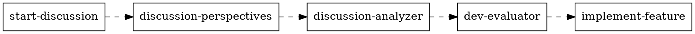

# Brainstorm Game Feature

## Overview

A complete workflow for brainstorming game features using GitHub discussions, persona-based perspectives, sentiment analysis, and development evaluation.

**Announce at start:** "I'm using brainstorm-game-feature to help develop this feature idea."

## When to Use

- User wants to brainstorm a new game feature
- User wants community/persona feedback on an idea
- User says "brainstorm", "feature idea", or "let's think about adding..."
- User wants to evaluate if a feature should be built

## Available Sub-Skills

| Sub-Skill | Use When |
|-----------|----------|
| `brainstorm-game-feature:full-pipeline` | Complete workflow from idea to evaluation |
| `brainstorm-game-feature:start-discussion` | Just create a GitHub discussion |
| `brainstorm-game-feature:discussion-perspectives` | Add 5 persona viewpoints to existing discussion |
| `brainstorm-game-feature:discussion-analyzer` | Analyze sentiment and rank features |
| `brainstorm-game-feature:dev-evaluator` | Evaluate architecture fit and effort |
| `brainstorm-game-feature:implement-feature` | Build from a DEV-EVAL ticket |

## Quick Start

**For most cases, use the full pipeline:**

```
Skill: brainstorm-game-feature:full-pipeline
Args: [user's feature idea]
```

This runs all stages: Discussion Creation → Perspectives → Analysis → Dev Evaluation

## Routing Guide

| User Request | Invoke |
|--------------|--------|
| "Brainstorm adding X" | `full-pipeline` |
| "Create a discussion about X" | `start-discussion` |
| "Get feedback on discussion #N" | `discussion-perspectives` |
| "Analyze discussion #N" | `discussion-analyzer` |
| "Should we build X?" | `dev-evaluator` |
| "Implement DEV-EVAL-N" | `implement-feature` |

## Pipeline Flow



Each stage builds on the previous. For partial workflows, invoke the specific sub-skill directly.
