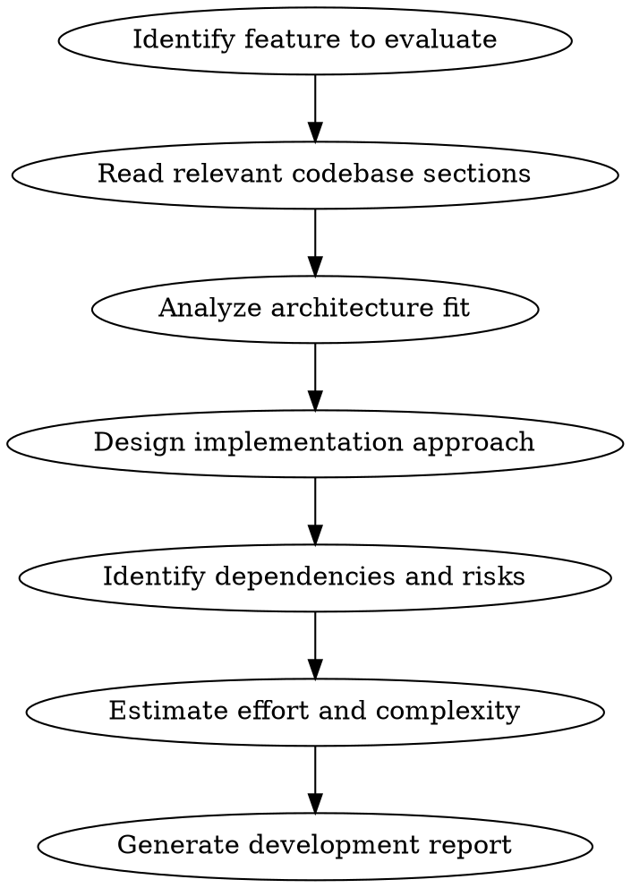

# Development Evaluator

## Overview

Takes a proposed feature (typically the top-ranked idea from discussion-analyzer) and evaluates it from a software development perspective. Analyzes architecture fit, implementation approach, dependencies, risks, and provides actionable development guidance.

**Announce at start:** "I'm using dev-evaluator to assess this feature from a development perspective."

## When to Use

- After running discussion-analyzer to evaluate the winning feature
- User says "evaluate [feature] for development" or "how would we build [feature]"
- Before sprint planning to assess feasibility
- When deciding between implementation approaches

## Process



## Step 1: Identify Feature

Extract the feature to evaluate from:
- Discussion analysis (top-ranked feature)
- User request
- GitHub discussion body

Clearly state:
- Feature name
- Core requirements
- Success criteria

## Step 2: Read Relevant Codebase

Based on the feature type, read the appropriate files:

### For Colonist/Population Features
```
src/core/models/Colonist.ts
src/core/systems/ColonyManager.ts
src/core/systems/WorkforceManager.ts
src/core/data/npcs.ts
```

### For Building Features
```
src/core/models/Building.ts
src/core/systems/BuildingManager.ts
src/core/data/buildings.ts
src/core/balance/OperationsBalance.ts
```

### For Resource Features
```
src/core/models/Resources.ts
src/core/systems/ResourceManager.ts
src/core/balance/EconomyBaseline.ts
```

### For Event Features
```
src/core/models/GameEvent.ts
src/core/systems/EventManager.ts
src/core/data/events.ts
```

### For UI Features
```
src/renderer/services/GameService.ts
src/renderer/components/[relevant].vue
```

### Always Read
```
src/core/GameState.ts          # Central orchestrator
CLAUDE.md                       # Architecture patterns
```

## Step 3: Architecture Fit Analysis

Evaluate how the feature fits existing architecture:

| Criterion | Questions to Answer |
|-----------|---------------------|
| **Data Model** | What new fields/types are needed? Do they extend existing models or require new ones? |
| **System Ownership** | Which manager owns this feature? Does it need a new manager? |
| **Tick Integration** | Does it need per-tick processing? Where in the tick order? |
| **State Flow** | How does data flow from core → GameService → Vue? |
| **Persistence** | What needs to be saved/loaded in toJSON/fromJSON? |

### Fit Ratings

| Rating | Meaning |
|--------|---------|
| **Native Fit** | Feature uses existing patterns exactly, minimal new code |
| **Good Fit** | Extends existing systems naturally, follows established patterns |
| **Moderate Fit** | Requires some new patterns but doesn't conflict with architecture |
| **Poor Fit** | Requires significant refactoring or architectural changes |
| **Breaking** | Fundamentally incompatible with current architecture |

## Step 4: Implementation Approach

Design the implementation:

### 4.1 Data Model Changes

```typescript
// Example: What new interfaces/types are needed?
interface ColonistSkill {
  id: string;
  name: string;
  effect: SkillEffect;
}

// What existing models need extension?
interface Colonist {
  // existing fields...
  skills: ColonistSkill[];  // NEW
}
```

### 4.2 System Changes

Identify which managers need modification:
- New methods needed
- Existing methods to modify
- New tick processing

### 4.3 Data Files

What static data is needed:
- New data file (e.g., `src/core/data/skills.ts`)
- Balance constants
- Default values

### 4.4 UI Changes

What Vue components need updates:
- New components
- Modified components
- New reactive state in GameService

## Step 5: Dependencies and Risks

### Dependencies

| Type | Examples |
|------|----------|
| **Blocking** | Must complete X before starting this |
| **Data** | Requires new data files/constants |
| **UI** | Requires new Vue components |
| **Testing** | Requires test infrastructure changes |

### Risk Assessment

| Risk | Likelihood | Impact | Mitigation |
|------|------------|--------|------------|
| Scope creep | | | |
| Performance | | | |
| Balance issues | | | |
| Breaking changes | | | |
| Integration bugs | | | |

Rate Likelihood and Impact as: Low, Medium, High

## Step 6: Effort Estimation

### Complexity Factors

| Factor | Weight | Score (1-5) |
|--------|--------|-------------|
| New data models | 1x | |
| System modifications | 2x | |
| New managers/systems | 3x | |
| UI changes | 1x | |
| Balance tuning | 2x | |
| Test coverage | 1x | |

### T-Shirt Sizing

| Size | Description | Typical Scope |
|------|-------------|---------------|
| **XS** | Trivial | Add field, tweak constant |
| **S** | Small | New data file, simple system method |
| **M** | Medium | New feature in existing manager, moderate UI |
| **L** | Large | New manager, significant UI, balance work |
| **XL** | Extra Large | Multiple new systems, architectural impact |

## Step 7: Generate Report

Structure the output as:

```markdown
# Development Evaluation: [Feature Name]

## Summary

| Aspect | Assessment |
|--------|------------|
| Architecture Fit | [Rating] |
| Complexity | [XS/S/M/L/XL] |
| Risk Level | [Low/Medium/High] |
| Recommendation | [Build / Build with caveats / Defer / Reject] |

## Feature Requirements

**Core:** [What must it do]
**Success Criteria:** [How we know it's done]

## Architecture Analysis

### Current State
[How the relevant system works today]

### Proposed Changes
[What changes are needed]

### Fit Assessment
[Why it does/doesn't fit well]

## Implementation Plan

### Phase 1: Data Model
- [ ] Add X to Colonist interface
- [ ] Create skills.ts data file
- [ ] Update toJSON/fromJSON

### Phase 2: Core Logic
- [ ] Add method to ColonyManager
- [ ] Integrate with tick cycle
- [ ] Add balance constants

### Phase 3: UI
- [ ] Update colonist detail panel
- [ ] Add skill display component

### Phase 4: Polish
- [ ] Balance tuning
- [ ] Test coverage
- [ ] Documentation

## Dependencies

**Must complete first:**
- [Dependency 1]

**Can parallelize:**
- [Task that can happen simultaneously]

## Risks and Mitigations

| Risk | Likelihood | Impact | Mitigation |
|------|------------|--------|------------|
| [Risk] | [L/M/H] | [L/M/H] | [Strategy] |

## Open Questions

1. [Question needing answer before implementation]
2. [Design decision to make]

## Recommendation

[Clear recommendation: Build / Build with caveats / Defer / Reject]

[Reasoning for recommendation]

---
*Generated by dev-evaluator skill*
```

## Example: Evaluating "Skill Specialization"

```markdown
# Development Evaluation: Skill Specialization

## Summary

| Aspect | Assessment |
|--------|------------|
| Architecture Fit | Good Fit |
| Complexity | S-M |
| Risk Level | Low |
| Recommendation | Build |

## Architecture Analysis

### Current State
- Colonists have: id, name, role, experience, health, morale
- ColonyManager handles population, health, morale updates
- WorkforceManager handles role assignments and experience

### Proposed Changes
- Add `skills: ColonistSkill[]` to Colonist model
- Create `src/core/data/skills.ts` with skill definitions
- Add skill effects to workforce calculations

### Fit Assessment
**Good Fit** — Skills are a natural extension of the existing Colonist model.
WorkforceManager already calculates efficiency bonuses from experience;
skill bonuses can use the same pattern. No new managers needed.

## Implementation Plan

### Phase 1: Data Model
- [ ] Define ColonistSkill interface in models/Colonist.ts
- [ ] Create src/core/data/skills.ts with 6-8 skills
- [ ] Add skills field to Colonist, default empty array
- [ ] Update ColonyManager.toJSON/fromJSON

### Phase 2: Core Logic
- [ ] Add skill assignment logic in ColonyManager
- [ ] Modify WorkforceManager.calculateEfficiency() to include skill bonuses
- [ ] Add skill-granting logic (random on arrival? earned?)

### Phase 3: UI
- [ ] Add skills display to colonist detail panel
- [ ] Show skill bonuses in workforce tooltip

## Risks and Mitigations

| Risk | Likelihood | Impact | Mitigation |
|------|------------|--------|------------|
| Balance issues | Medium | Medium | Start with small bonuses (+5-10%), tune based on playtesting |
| Skill overlap with roles | Low | Low | Design skills to complement roles, not duplicate |

## Recommendation

**Build** — This is a straightforward extension that adds player value with minimal
architectural risk. Start with 6-8 well-designed skills and expand based on feedback.
```

## Quick Reference

| Task | Files to Read |
|------|---------------|
| Colonist features | `ColonyManager.ts`, `WorkforceManager.ts`, `Colonist.ts` |
| Building features | `BuildingManager.ts`, `Building.ts`, `buildings.ts` |
| Resource features | `ResourceManager.ts`, `Resources.ts`, `EconomyBaseline.ts` |
| Event features | `EventManager.ts`, `GameEvent.ts`, `events.ts` |
| All features | `GameState.ts`, `CLAUDE.md` |

## Common Mistakes

| Mistake | Fix |
|---------|-----|
| Not reading existing code | Always understand current architecture before proposing changes |
| Underestimating UI work | Vue reactivity and state sync often take longer than expected |
| Ignoring persistence | Every new field needs toJSON/fromJSON handling |
| Skipping balance analysis | New mechanics need balance constants, not magic numbers |
| Vague implementation steps | Each step should be a concrete, completable task |
