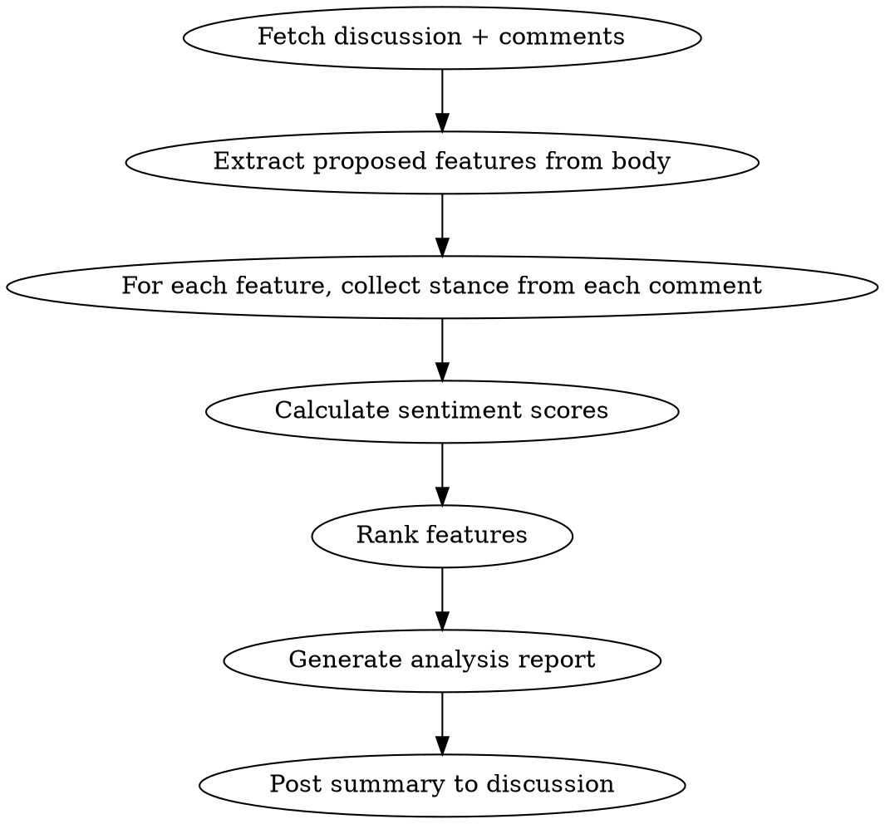

# Discussion Analyzer

## Overview

Reads a GitHub discussion and its comments, extracts proposed features, evaluates pros/cons from each comment, and produces a ranked sentiment analysis. Useful for synthesizing feedback after running discussion-perspectives or gathering community input.

**Announce at start:** "I'm using discussion-analyzer to evaluate the pros/cons and rank features by sentiment."

## When to Use

- After running discussion-perspectives to synthesize the viewpoints
- When a discussion has accumulated community feedback
- User says "analyze discussion #X" or "summarize feedback on #X"
- Before implementation to prioritize features

## Process



## Step 1: Fetch Discussion

Get the full discussion with all comments:

```bash
gh api graphql -f query='
{
  repository(owner: "elliottregan", name: "space-game-demo") {
    discussion(number: NUMBER) {
      id
      title
      body
      comments(first: 50) {
        nodes {
          body
          author { login }
        }
      }
    }
  }
}'
```

## Step 2: Extract Proposed Features

Parse the discussion body to identify discrete features. Look for:
- Numbered sections (### 1. Feature Name)
- Bullet points under "Proposed Features"
- Distinct system proposals

Create a list of feature IDs and names:

```
features = [
  { id: "personalities", name: "Colonist Personalities" },
  { id: "relationships", name: "Relationships & Social Dynamics" },
  { id: "quests", name: "Personal Quests & Goals" },
  ...
]
```

## Step 3: Analyze Each Comment

For each comment, determine stance on each feature:

| Stance | Score | Indicators |
|--------|-------|------------|
| **Strong Support** | +2 | "love", "exactly right", "brilliant", "must have" |
| **Support** | +1 | "like", "good idea", "could work", "interesting" |
| **Neutral** | 0 | No mention, or balanced pros/cons |
| **Oppose** | -1 | "concerned", "worried", "cut this", "defer" |
| **Strong Oppose** | -2 | "hard no", "hate", "kill this", "scope creep" |

Also extract:
- **Pros**: Specific benefits mentioned
- **Cons**: Specific concerns or risks mentioned
- **Conditions**: "Would support IF..." statements

## Step 4: Calculate Sentiment Scores

For each feature:

```
sentiment_score = sum(comment_stances) / num_comments_mentioning_feature
consensus = 1 - (std_deviation / 2)  # Higher = more agreement
priority_score = sentiment_score * consensus
```

| Score Range | Label |
|-------------|-------|
| 1.5 to 2.0 | Strong Support |
| 0.5 to 1.5 | Supported |
| -0.5 to 0.5 | Contested |
| -1.5 to -0.5 | Opposed |
| -2.0 to -1.5 | Strong Opposition |

## Step 5: Generate Analysis Report

Structure the output as:

```markdown
# Discussion Analysis: [Title]

## Feature Ranking by Sentiment

| Rank | Feature | Score | Consensus | Verdict |
|------|---------|-------|-----------|---------|
| 1 | Skill Specialization | +1.6 | High | Strong Support |
| 2 | Personality Traits | +0.8 | Medium | Supported |
| 3 | Hidden Traits | +0.2 | Low | Contested |
| 4 | Relationships | -0.4 | Medium | Contested |
| 5 | Personal Quests | -1.2 | High | Opposed |

## Detailed Analysis

### 1. [Top Feature] — Strong Support

**Pros:**
- [Pro from Comment 1]
- [Pro from Comment 2]

**Cons:**
- [Con if any]

**Key Quotes:**
> "Exactly the kind of clear, readable differences..." — Casual Player
> "Make losing specific colonists sting" — Scope Guardian

**Conditions for Success:**
- [Any "would support if" conditions]

---

### 2. [Next Feature] — Supported
[Continue pattern...]

---

## Consensus Points

Things most/all commenters agreed on:
- [Agreement 1]
- [Agreement 2]

## Unresolved Tensions

Issues where commenters fundamentally disagree:
- [Tension 1]: [Side A] vs [Side B]
- [Tension 2]: [Side A] vs [Side B]

## Recommended MVP

Based on sentiment analysis, prioritize for v1:
1. [Highest scored feature]
2. [Second highest]

Defer to v2:
- [Opposed features]

## Open Questions

Questions raised that need answers before implementation:
1. [Question]
2. [Question]
```

## Step 6: Post Analysis to Discussion

Add the analysis as a comment:

```bash
gh api graphql -f query='
mutation {
  addDiscussionComment(input: {
    discussionId: "DISCUSSION_ID"
    body: "ANALYSIS_MARKDOWN"
  }) {
    comment { id url }
  }
}'
```

## Sentiment Analysis Tips

### Identifying Stances

Look for explicit stance markers:

| Phrase Pattern | Likely Stance |
|----------------|---------------|
| "I love / love the idea of" | Strong Support |
| "This is exactly right" | Strong Support |
| "I could get behind" | Support |
| "What I'd consider keeping" | Support |
| "concerns me deeply" | Oppose |
| "Hard no on" | Strong Oppose |
| "Cut entirely for v1" | Strong Oppose |
| "defer to v2" | Oppose |

### Handling Conditional Support

When a comment says "I'd support X if Y":
- Count as +0.5 (conditional support)
- Record the condition in the analysis
- Multiple conditions from different sources = important design constraint

### Weighting by Persona

If comments are from discussion-perspectives personas, consider:
- Technical Lead opposition on complexity = implementation risk
- Scope Guardian opposition = timeline risk
- Casual Player opposition = accessibility risk
- Hardcore Player opposition = depth risk
- Game Designer concerns = balance risk

## Quick Reference

| Task | Command |
|------|---------|
| Fetch discussion | `gh api graphql` with `discussion(number: N)` query |
| Post analysis | `gh api graphql` with `addDiscussionComment` mutation |

## Example Output

```
# Discussion Analysis: Colonist Individuality

## Feature Ranking by Sentiment

| Rank | Feature | Score | Consensus | Verdict |
|------|---------|-------|-----------|---------|
| 1 | Skill Specialization | +1.6 | High | Strong Support |
| 2 | Visible Traits | +0.8 | High | Supported |
| 3 | Hidden Traits | +0.4 | Low | Contested |
| 4 | Relationship Effects | -0.2 | Low | Contested |
| 5 | Personal Quests | -1.4 | High | Opposed |

## Recommended MVP

Build for v1:
1. Skill Specialization (2-3 unique skills per colonist)
2. Single visible personality trait with morale modifier

Defer to v2:
- Relationship simulation
- Personal quests
- Backstory system
```

## Common Mistakes

| Mistake | Fix |
|---------|-----|
| Counting neutral mentions as support | Only score explicit stances |
| Missing conditional support | Look for "if/would/could" patterns |
| Ignoring consensus level | High opposition + high support = contested, not neutral |
| Not extracting specific quotes | Quotes make the analysis credible |
| Huge wall of text | Use tables and clear hierarchy |
