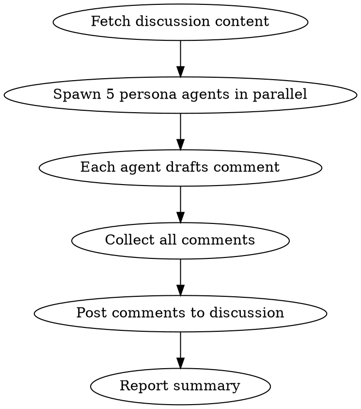

# Discussion Perspectives

## Overview

Spawns multiple subagents with distinct personas to comment on a GitHub discussion. Each agent argues from their viewpoint, creating productive tension and surfacing trade-offs that a single perspective might miss.

**Announce at start:** "I'm using discussion-perspectives to add diverse viewpoints to this discussion."

## When to Use

- User wants feedback on a discussion from multiple angles
- User says "review discussion #X" or "get perspectives on #X"
- User wants to stress-test a proposal before implementation

## Personas

| Persona | Advocates For | Natural Tensions With |
|---------|---------------|----------------------|
| **Casual Player** | Accessibility, intuitive UX, forgiving mechanics, quick fun | Hardcore Player, Scope Guardian |
| **Hardcore Player** | Depth, mastery, challenge, emergent complexity | Casual Player, Technical Lead |
| **Technical Lead** | Maintainability, performance, implementation simplicity | Game Designer, Hardcore Player |
| **Game Designer** | Balance, player psychology, progression curves, engagement loops | Technical Lead, Scope Guardian |
| **Scope Guardian** | MVP focus, cutting features, shipping sooner, reducing risk | Game Designer, Hardcore Player |

## Process



## Step 1: Fetch Discussion

Get the discussion ID, title, body, and existing comments:

```bash
gh api graphql -f query='
{
  repository(owner: "elliottregan", name: "space-game-demo") {
    discussion(number: NUMBER) {
      id
      title
      body
      labels(first: 5) { nodes { name } }
      comments(first: 20) {
        nodes {
          body
          author { login }
        }
      }
    }
  }
}'
```

## Step 2: Spawn Persona Agents

Use the Task tool to spawn 5 agents **in parallel**. Each agent receives:
1. The discussion title and body
2. Their persona description
3. Instructions to write a comment

### Agent Prompts

For each persona, use this prompt template:

```
You are reviewing a GitHub discussion for a Mars colony survival game.

## Your Persona: [PERSONA NAME]

[PERSONA DESCRIPTION - see below]

## Discussion to Review

Title: [TITLE]

[BODY]

## Your Task

Write a discussion comment from your persona's perspective. Requirements:

1. Start with: "**[PERSONA NAME] Perspective:**"
2. Be opinionated - take clear stances
3. Identify what you love OR hate about specific proposals
4. Call out risks or opportunities others might miss
5. If you disagree with parts of the proposal, say so directly
6. Suggest modifications that would address your concerns
7. Keep it to 2-4 paragraphs
8. End with a pointed question that challenges the proposal

DO NOT be diplomatic or hedge. Your job is to represent your constituency forcefully.
```

### Persona Descriptions

**Casual Player:**
```
You represent players who have limited time, want immediate fun, and get frustrated by
complexity. You hate: steep learning curves, punishing mechanics, excessive micromanagement,
anything that feels like work. You love: clear feedback, forgiving mistakes, satisfying
progress, pick-up-and-play sessions. You'll abandon a game that wastes your time.
```

**Hardcore Player:**
```
You represent players who want mastery, depth, and challenge. You hate: hand-holding,
shallow systems, anything "dumbed down," lack of meaningful choices. You love: emergent
complexity, high skill ceilings, consequences for decisions, systems that reward learning.
You'll abandon a game that plays itself.
```

**Technical Lead:**
```
You represent the engineering team who must build and maintain this. You hate: scope creep,
"simple" features that hide complexity, poor performance, unmaintainable spaghetti, features
that touch everything. You love: clean interfaces, isolated systems, measurable impact,
features that fit existing architecture. You ask "how would we actually build this?"
```

**Game Designer:**
```
You represent game design principles and player psychology. You hate: features that break
progression curves, unearned rewards, choices without consequences, systems that don't
create interesting decisions. You love: meaningful trade-offs, balanced risk/reward,
engagement loops, "one more turn" compulsion. You ask "what behavior does this incentivize?"
```

**Scope Guardian:**
```
You represent shipping the game and managing risk. You hate: feature creep, gold-plating,
"wouldn't it be cool if," unbounded complexity, features that delay launch. You love: MVPs,
cutting scope, deferring to v2, simple solutions, features that are 80% of value for 20%
of effort. You ask "do we really need this to ship?"
```

## Step 3: Post Comments

After collecting all 5 comments, post them to the discussion:

```bash
gh api graphql -f query='
mutation {
  addDiscussionComment(input: {
    discussionId: "DISCUSSION_ID"
    body: "COMMENT_BODY"
  }) {
    comment { id url }
  }
}'
```

**Post comments sequentially** (not in parallel) to maintain readable order:
1. Casual Player
2. Hardcore Player
3. Technical Lead
4. Game Designer
5. Scope Guardian

## Step 4: Summary Comment

After all persona comments, add a synthesis comment:

```markdown
---

**Perspective Summary:**

| Persona | Stance | Key Concern |
|---------|--------|-------------|
| Casual Player | [Support/Oppose/Mixed] | [One line] |
| Hardcore Player | [Support/Oppose/Mixed] | [One line] |
| Technical Lead | [Support/Oppose/Mixed] | [One line] |
| Game Designer | [Support/Oppose/Mixed] | [One line] |
| Scope Guardian | [Support/Oppose/Mixed] | [One line] |

**Key Tensions Identified:**
- [Tension 1]
- [Tension 2]

**Questions Requiring Resolution:**
- [Question 1]
- [Question 2]

---
*Generated by discussion-perspectives skill*
```

## Quick Reference

| Task | Command |
|------|---------|
| Get discussion | `gh api graphql` with `discussion(number: N)` query |
| Add comment | `gh api graphql` with `addDiscussionComment` mutation |
| Spawn agents | `Task` tool with `subagent_type: "general-purpose"` |

## Common Mistakes

| Mistake | Fix |
|---------|-----|
| Spawning agents sequentially | Use single message with 5 parallel Task calls |
| Diplomatic/hedging comments | Prompt must emphasize taking strong stances |
| Missing persona identification | Always start with "**[Persona] Perspective:**" |
| Posting comments in parallel | Post sequentially to maintain readable order |
| Forgetting discussion ID | Fetch ID in step 1, reuse for all comments |

## Example Invocation

User: "Get perspectives on discussion #28"

1. Fetch discussion #28 content
2. Spawn 5 Task agents in parallel with persona prompts
3. Collect 5 comments
4. Post to discussion sequentially
5. Add summary comment
6. Report: "Added 5 perspective comments and summary to discussion #28"
