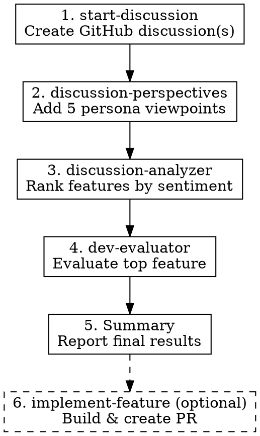

# Full Pipeline

## Overview

Orchestrates the complete brainstorming workflow by invoking each skill in the `brainstorm-game-feature` namespace in sequence. Takes a user's feature idea or topic and produces a fully analyzed, development-ready proposal.

**Announce at start:** "I'm using full-pipeline to run the complete brainstorming workflow."

## When to Use

- User wants end-to-end feature development workflow
- User says "brainstorm and evaluate [topic]" or "full pipeline for [topic]"
- User wants to go from idea to implementation plan in one flow

## Pipeline Stages



## Process

### Stage 1: Create Discussion

**Invoke:** `brainstorm-game-feature:start-discussion`

Pass the user's topic/idea. This skill will:
- Analyze the codebase for context
- Generate a well-structured discussion
- Create it on GitHub with appropriate labels
- Return the discussion number

**Capture:** Discussion number (e.g., `#32`)

### Stage 2: Add Perspectives

**Invoke:** `brainstorm-game-feature:discussion-perspectives`

Pass: "Get perspectives on discussion #[NUMBER]"

This skill will:
- Spawn 5 persona agents (Casual Player, Hardcore Player, Technical Lead, Game Designer, Scope Guardian)
- Post each perspective as a comment
- Add a summary comment

**Wait for completion** before proceeding.

### Stage 3: Analyze Sentiment

**Invoke:** `brainstorm-game-feature:discussion-analyzer`

Pass: "Analyze discussion #[NUMBER]"

This skill will:
- Read all comments
- Extract proposed features
- Score sentiment for each feature
- Rank features and post analysis

**Capture:** Top-ranked feature name and score

### Stage 4: Development Evaluation

**Invoke:** `brainstorm-game-feature:dev-evaluator`

Pass: "Evaluate [TOP FEATURE] for discussion #[NUMBER]"

This skill will:
- Read relevant codebase sections
- Assess architecture fit
- Design implementation approach
- Estimate effort and risks
- Post development evaluation with `🎫 DEV-EVAL-{number}` header
- Add `ready-for-ticket` label to the discussion

**Capture:** Recommendation (Build/Defer/Reject) and effort estimate

### Stage 5: Final Summary

After all stages complete, report:

```markdown
## Pipeline Complete: [Topic]

### Discussion Created
- **Discussion:** #[NUMBER] - [TITLE]
- **Link:** [URL]

### Perspectives Added
- 5 viewpoints posted (Casual, Hardcore, Technical, Designer, Scope Guardian)
- Key tensions identified

### Feature Ranking
| Rank | Feature | Score | Verdict |
|------|---------|-------|---------|
| 1 | [Feature] | [Score] | [Verdict] |
| 2 | [Feature] | [Score] | [Verdict] |
...

### Development Evaluation: [Top Feature]
- **Ticket ID:** 🎫 DEV-EVAL-[NUMBER]
- **Architecture Fit:** [Rating]
- **Complexity:** [Size]
- **Recommendation:** [Build/Defer/Reject]
- **Effort:** [Estimate]
- **Label:** `ready-for-ticket` added

### Next Steps
1. Run `brainstorm-game-feature:implement-feature` with DEV-EVAL-[NUMBER] to build it
2. Or manually implement following the evaluation's implementation plan
```

## Invoking Sub-Skills

Use the `Skill` tool to invoke each sub-skill:

```
Skill: brainstorm-game-feature:start-discussion
Args: [user's topic]
```

```
Skill: brainstorm-game-feature:discussion-perspectives
Args: discussion #32
```

```
Skill: brainstorm-game-feature:discussion-analyzer
Args: discussion #32
```

```
Skill: brainstorm-game-feature:dev-evaluator
Args: evaluate "Skill Specialization" from discussion #32
```

## Important Notes

1. **Sequential execution** — Each stage depends on the previous stage's output
2. **Capture discussion number** — You need this for all subsequent stages
3. **Wait for completion** — Don't proceed until each skill finishes
4. **Error handling** — If a stage fails, report the error and stop the pipeline
5. **User can interrupt** — If user wants to stop early, respect that

## Partial Pipeline Options

Users may want to run only part of the pipeline:

| User Request | Action |
|--------------|--------|
| "Just create a discussion about X" | Run only `start-discussion` |
| "Get perspectives on discussion #N" | Run only `discussion-perspectives` |
| "Analyze discussion #N" | Run only `discussion-analyzer` |
| "Evaluate feature X" | Run only `dev-evaluator` |
| "Full pipeline for X" | Run stages 1-5 |
| "Implement DEV-EVAL-N" | Run only `implement-feature` |
| "Full pipeline with implementation" | Run all stages including implementation |

## Example Invocation

**User:** "Full pipeline for adding a weather system"

**Stage 1:** Invoke `start-discussion` with "weather system for Mars colony"
- Creates discussion #32 "Dynamic Mars Weather System"

**Stage 2:** Invoke `discussion-perspectives` with "discussion #32"
- Adds 5 perspective comments + summary

**Stage 3:** Invoke `discussion-analyzer` with "discussion #32"
- Posts sentiment analysis
- Top feature: "Dust Storms" (+1.4, Supported)

**Stage 4:** Invoke `dev-evaluator` with "Dust Storms from discussion #32"
- Posts development evaluation
- Recommendation: Build, Complexity: M

**Stage 5:** Report final summary to user

## Common Mistakes

| Mistake | Fix |
|---------|-----|
| Running stages in parallel | Must be sequential — each depends on previous |
| Forgetting discussion number | Capture it from stage 1, use in all subsequent stages |
| Skipping to dev-evaluator | Need perspectives and analysis first for proper evaluation |
| Not waiting for skill completion | Each skill must finish before invoking next |
