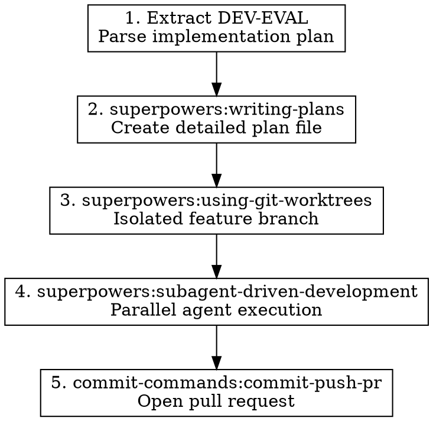

# Implement Feature

## Overview

Takes a completed dev evaluation (identified by `DEV-EVAL-{number}`) and executes the full implementation workflow: creates a detailed plan, sets up an isolated git worktree, implements using parallel agents, and opens a PR.

**Announce at start:** "I'm using implement-feature to build [FEATURE] from DEV-EVAL-[NUMBER]."

## When to Use

- After `dev-evaluator` has posted a "Build" recommendation
- User says "implement DEV-EVAL-32" or "build the feature from discussion #32"
- User wants to go from evaluation to PR in one workflow

## Prerequisites

- A discussion with a `ready-for-ticket` label
- A `DEV-EVAL-{number}` comment with Build recommendation
- Clean git state (no uncommitted changes in main workspace)

## Pipeline Stages



## Process

### Stage 1: Extract DEV-EVAL

Fetch the dev evaluation comment from the discussion:

```bash
# Get discussion comments and find DEV-EVAL
gh api graphql -f query='
{
  repository(owner: "elliottregan", name: "space-game-demo") {
    discussion(number: NUMBER) {
      title
      body
      comments(first: 20) {
        nodes {
          body
          author { login }
        }
      }
    }
  }
}'
```

Parse the DEV-EVAL comment to extract:

| Field | Where to Find |
|-------|---------------|
| Feature Name | `# Development Evaluation: [NAME]` |
| Architecture Fit | Summary table |
| Complexity | Summary table (XS/S/M/L/XL) |
| Recommendation | Must be "Build" to proceed |
| Implementation Phases | Markdown sections with checkboxes |
| Files to Modify | Listed at end of evaluation |
| Risks | Risk table |

**Stop if recommendation is not "Build"** — report to user and exit.

### Stage 2: Create Detailed Plan

**Invoke:** `superpowers:writing-plans`

Transform the DEV-EVAL implementation phases into a detailed plan file.

Input to the skill:
```
Create an implementation plan for: [FEATURE NAME]

From DEV-EVAL-[NUMBER]:
- Architecture Fit: [RATING]
- Complexity: [SIZE]
- Files to modify: [LIST]

Implementation Phases from evaluation:
[PASTE PHASES FROM DEV-EVAL]

Requirements:
- Follow existing codebase patterns (see CLAUDE.md)
- Maintain core/renderer separation
- Include test coverage for new logic
```

**Capture:** Path to the plan file (typically `.claude/plans/[feature].md`)

### Stage 3: Create Worktree

**Invoke:** `superpowers:using-git-worktrees`

Create an isolated git worktree for the feature:

Input to the skill:
```
Create a worktree for implementing: [FEATURE NAME]
Branch name suggestion: feature/[kebab-case-feature-name]
From: main
```

**Capture:**
- Worktree path (e.g., `../space-game-demo-feature-recreation-buildings`)
- Branch name (e.g., `feature/recreation-buildings`)

### Stage 4: Implement with Agents

**Invoke:** `superpowers:subagent-driven-development`

Execute the plan using parallel agents in the worktree:

Input to the skill:
```
Execute the implementation plan at: [PLAN FILE PATH]
Working directory: [WORKTREE PATH]

Key tasks from the plan:
1. [Task 1 from plan]
2. [Task 2 from plan]
...

Constraints:
- All work must happen in the worktree
- Follow patterns in CLAUDE.md
- Run tests after implementation
```

**Wait for all agents to complete.**

### Stage 5: Create Pull Request

**Invoke:** `commit-commands:commit-push-pr`

Create commits and open PR:

Input to the skill:
```
In worktree: [WORKTREE PATH]

Create a PR for: [FEATURE NAME]

Reference: Discussion #[NUMBER], DEV-EVAL-[NUMBER]

Summary of changes:
[Summary from plan execution]
```

The PR should:
- Reference the original discussion
- Include the DEV-EVAL identifier
- Summarize what was implemented
- List any deviations from the plan

## Branch Naming Convention

| Feature Type | Branch Name Pattern |
|--------------|---------------------|
| New feature | `feature/[kebab-case-name]` |
| Enhancement | `enhance/[kebab-case-name]` |
| Refactor | `refactor/[kebab-case-name]` |

Examples:
- `feature/recreation-buildings`
- `enhance/morale-system`
- `refactor/colonist-tracking`

## PR Template

The PR should follow this structure:

```markdown
## Summary

Implements [FEATURE NAME] as designed in Discussion #[NUMBER].

**DEV-EVAL Reference:** DEV-EVAL-[NUMBER]

## Changes

- [Bullet list of changes made]

## Implementation Notes

[Any deviations from the original plan or decisions made during implementation]

## Testing

- [ ] Unit tests added/updated
- [ ] Manual testing completed
- [ ] Existing tests pass

## Related

- Discussion: #[NUMBER]
- Original Proposal: [Link to discussion]
```

## Error Handling

| Stage | If Error | Action |
|-------|----------|--------|
| Extract | DEV-EVAL not found | Report error, suggest running dev-evaluator first |
| Extract | Recommendation not "Build" | Report recommendation, ask user if they want to proceed anyway |
| Plan | Plan creation fails | Report error, allow manual plan creation |
| Worktree | Git state unclean | Report status, ask user to commit/stash |
| Implement | Agent fails | Report which task failed, allow retry or manual fix |
| PR | Push fails | Report error, suggest checking remote permissions |

## Invoking Sub-Skills

```
Skill: superpowers:writing-plans
Args: [feature requirements from DEV-EVAL]
```

```
Skill: superpowers:using-git-worktrees
Args: feature/[feature-name] from main
```

```
Skill: superpowers:subagent-driven-development
Args: execute plan at [path] in worktree [path]
```

```
Skill: commit-commands:commit-push-pr
Args: PR for [feature] referencing discussion #[number]
```

## Quick Reference

| Task | Skill |
|------|-------|
| Parse DEV-EVAL | Manual (GraphQL query + parsing) |
| Create plan | `superpowers:writing-plans` |
| Create worktree | `superpowers:using-git-worktrees` |
| Implement | `superpowers:subagent-driven-development` |
| Commit & PR | `commit-commands:commit-push-pr` |

## Common Mistakes

| Mistake | Fix |
|---------|-----|
| Starting without Build recommendation | Always check recommendation first |
| Implementing in main workspace | Always use worktree for isolation |
| Skipping the plan | Plan ensures organized, reviewable implementation |
| Not referencing discussion | PR must link back to DEV-EVAL and discussion |
| Implementing rejected features | Only proceed with "Build" recommendations |
| Forgetting to run tests | Always verify tests pass before PR |

## Example Invocation

**User:** "implement DEV-EVAL-32"

**Stage 1:** Fetch discussion #32, find DEV-EVAL-32 comment
- Feature: Recreation Buildings
- Recommendation: Build
- Complexity: S-M

**Stage 2:** Invoke `superpowers:writing-plans`
- Creates `.claude/plans/recreation-buildings.md`

**Stage 3:** Invoke `superpowers:using-git-worktrees`
- Creates `../space-game-demo-feature-recreation-buildings`
- Branch: `feature/recreation-buildings`

**Stage 4:** Invoke `superpowers:subagent-driven-development`
- Executes plan tasks in parallel
- Runs tests, all pass

**Stage 5:** Invoke `commit-commands:commit-push-pr`
- Creates PR #15: "Add Recreation Buildings for Morale System"
- References Discussion #32, DEV-EVAL-32

**Report to user:**
```
## Implementation Complete: Recreation Buildings

**PR Created:** #15
**Branch:** feature/recreation-buildings
**Discussion:** #32
**DEV-EVAL:** DEV-EVAL-32

### Changes Made
- Added `moraleBoost` field to BuildingDefinition
- Created 4 recreation buildings in buildings.ts
- Updated ColonyManager to apply morale boosts
- Added UI category filter in BuildingPanel

### Next Steps
1. Review PR #15
2. Run manual testing
3. Merge when approved
```

## Post-Implementation

After PR is created:

1. **Update Discussion** — Add comment linking to the PR
2. **Remove Label** — Optionally remove `ready-for-ticket` and add `in-progress` or `implemented`
3. **Clean Worktree** — Can remove worktree after PR is merged

```bash
# Add PR link to discussion
gh api graphql -f query='
mutation {
  addDiscussionComment(input: {
    discussionId: "DISCUSSION_ID"
    body: "Implementation PR: #[PR_NUMBER]\n\nBranch: `feature/[name]`"
  }) { comment { id } }
}'

# Remove worktree after merge (optional)
git worktree remove ../space-game-demo-feature-[name]
```
