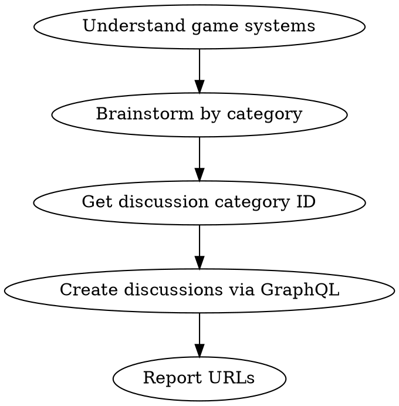

# Brainstorm to Discussions

## Overview

Generate feature ideas by analyzing existing game systems, then create well-structured GitHub discussions for community input.

**Announce at start:** "I'm using brainstorm-to-discussions to explore the codebase, generate ideas, and create discussions."

## When to Use

- User asks to brainstorm game features/improvements
- User wants to create GitHub discussions from ideas
- User wants community input on potential features

## Process



## Step 1: Understand the Game

Read these files to understand existing systems:

| File | What You Learn |
|------|----------------|
| `src/core/GameState.ts` | All game systems and tick order |
| `src/core/data/buildings.ts` | Building types, costs, production |
| `src/core/data/technologies.ts` | Tech tree structure |
| `src/core/data/events.ts` | Random event types |
| `src/core/data/factions.ts` | Political factions |
| `src/core/data/npcs.ts` | NPC characters and projects |
| `src/core/systems/VictoryManager.ts` | Win/lose conditions |
| `src/core/systems/ColonyManager.ts` | Population, health, morale |
| `src/core/systems/OperationsManager.ts` | Expeditions, prospecting |

## Step 2: Brainstorm by Category

Generate ideas across these game areas:

| Category | Think About |
|----------|-------------|
| **Environment** | Weather, seasons, terrain, hazards |
| **Colonists** | Personalities, relationships, skills, stories |
| **Politics** | Elections, negotiations, crises, factions |
| **Resources** | New types, trading, supply chains |
| **Buildings** | Upgrades, maintenance, new types |
| **Technology** | New branches, research mechanics |
| **Events** | Event chains, disasters, opportunities |
| **Victory** | Alternative win conditions, endgame content |

**Quality over quantity**: 3-5 well-developed themes beat 10 shallow ideas.

## Step 3: Get Repository and Category IDs

GitHub discussions require IDs from GraphQL. Run this query:

```bash
gh api graphql -f query='
{
  repository(owner: "elliottregan", name: "space-game-demo") {
    id
    discussionCategories(first: 10) {
      nodes {
        id
        name
      }
    }
  }
}'
```

Use the **Ideas** category for feature brainstorming (ID: `DIC_kwDOQ-Dazc4C1UcX`).

## Step 4: Create Discussions via GraphQL

The `gh` CLI doesn't have a built-in `discussion` command. Use the GraphQL mutation:

```bash
gh api graphql -f query='
mutation {
  createDiscussion(input: {
    repositoryId: "R_kgDOQ-DazQ"
    categoryId: "DIC_kwDOQ-Dazc4C1UcX"
    title: "Feature Title Here"
    body: "Discussion body in markdown..."
  }) {
    discussion {
      url
      number
    }
  }
}'
```

**Create discussions in parallel** for efficiency.

## Discussion Content Template

Use this structure for each discussion:

```markdown
## Overview

[2-3 sentences describing the feature theme]

## Proposed Features

### 1. Feature Name
- Bullet points describing the feature
- How it affects gameplay
- Example scenarios

### 2. Feature Name
[Continue pattern...]

## Implementation Considerations

- Technical complexity notes
- How it fits existing architecture
- Potential opt-in/difficulty settings

## Questions for Discussion

- Open question 1?
- Open question 2?
- Open question 3?
```

## Quick Reference

| Task | Command/Tool |
|------|--------------|
| List categories | `gh api graphql` with `discussionCategories` query |
| Create discussion | `gh api graphql` with `createDiscussion` mutation |
| Get repo ID | `gh api graphql` with `repository(owner, name) { id }` |

**Repository ID**: `R_kgDOQ-DazQ`
**Ideas Category ID**: `DIC_kwDOQ-Dazc4C1UcX`

## Common Mistakes

| Mistake | Fix |
|---------|-----|
| Using `gh discussion create` | Command doesn't exist; use GraphQL API |
| Missing category ID | Query `discussionCategories` first |
| Creating sequentially | Run mutations in parallel for speed |
| Shallow ideas | Read codebase thoroughly before brainstorming |
| No questions section | Always include 2-3 discussion prompts |

## Example Output

After running, report:

```
Created 4 discussions:

| # | Title | Link |
|---|-------|------|
| 19 | Dynamic Mars Environment | https://github.com/.../discussions/19 |
| 20 | Colonist Stories | https://github.com/.../discussions/20 |
...
```
