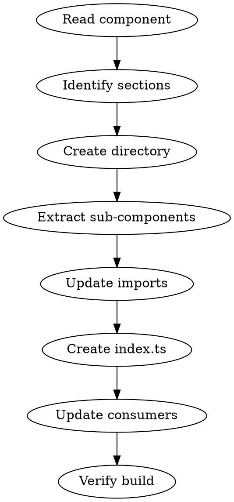

# Vue Component Extractor

## Overview

Extract large Vue Single File Components (150+ lines) into focused sub-components within a dedicated directory, with barrel exports for clean imports.

**Announce at start:** "I'm using vue-component-extractor to break this component into sub-components."

## When to Use

- Vue SFC exceeds 150 lines
- Component has 3+ distinct template sections
- Multiple `v-for` loops rendering different entity types
- Repeated patterns that could be reusable
- Component has distinct "modes" or "tabs"

## Process



## Step 1: Analyze Component

Read the target component and identify:

| Look For | Becomes |
|----------|---------|
| Distinct `<section>` blocks | Separate component |
| `v-for` with complex item template | ItemCard component |
| Modal/overlay content | Modal component |
| Tab content blocks | TabContent components |
| Repeated button groups | ButtonGroup component |
| Form sections | FormSection component |

## Step 2: Create Directory Structure

```bash
mkdir -p src/renderer/components/ComponentName
git mv src/renderer/components/ComponentName.vue src/renderer/components/ComponentName/ComponentName.vue
```

## Step 3: Extract Sub-Components

For each identified section, create a new `.vue` file:

**Props pattern:**
```typescript
defineProps<{
  // Data the sub-component needs to display
  item: ItemType;
  // State it needs to know about
  selected?: boolean;
  disabled?: boolean;
}>();
```

**Emits pattern:**
```typescript
const emit = defineEmits<{
  // User actions bubble up
  select: [id: string];
  action: [type: string, payload: unknown];
}>();
```

**Keep in parent:**
- State management (ref, reactive)
- API calls
- Computed properties combining multiple data sources

**Move to child:**
- Display logic for that section
- Section-specific formatting functions
- Section-specific styles

## Step 4: Update Import Paths

Sub-components are one level deeper. Update relative imports:

| Before | After |
|--------|-------|
| `../services/Foo` | `../../services/Foo` |
| `../../core/models/Bar` | `../../../core/models/Bar` |
| `../ui` | `../../ui` |

## Step 5: Create Barrel Export

Create `index.ts`:

```typescript
export { default as ComponentName } from "./ComponentName.vue";
```

## Step 6: Update Consumers

Find and update imports in consuming files:

```typescript
// Before
import ComponentName from "./ComponentName.vue";

// After
import { ComponentName } from "./ComponentName";
```

## Step 7: Verify

```bash
bun run lint && bun run build
```

## Quick Reference

| Section Type | Props | Emits |
|--------------|-------|-------|
| List item | `item`, `selected` | `click`, `select` |
| Modal | `data`, `open` | `confirm`, `cancel` |
| Form section | `modelValue`, `errors` | `update:modelValue` |
| Tab content | tab-specific data | tab-specific actions |
| Status display | `value`, `variant` | (none usually) |

## Common Mistakes

| Mistake | Fix |
|---------|-----|
| Forgetting to update import paths | Check all `../` references |
| Not updating consumers | `grep -r "ComponentName" src/` |
| Duplicating state in children | Keep state in parent, pass as props |
| Over-extracting (too granular) | Only extract if section is 20+ lines or reusable |

## Example Extraction

**Before:** `PoliticsPanel.vue` (317 lines)

**After:**
```
PoliticsPanel/
  PoliticsPanel.vue (94 lines) - orchestrator
  AverageSupportDisplay.vue   - support % display
  FactionCard.vue             - individual faction
  DecisionsList.vue           - available decisions
  DecisionModal.vue           - confirmation modal
  index.ts                    - barrel export
```

## Commit Message Template

```
refactor: extract ComponentName into sub-components

Break up ComponentName.vue into focused, single-responsibility
components for better maintainability:

- SubComponent1: brief description
- SubComponent2: brief description
```
